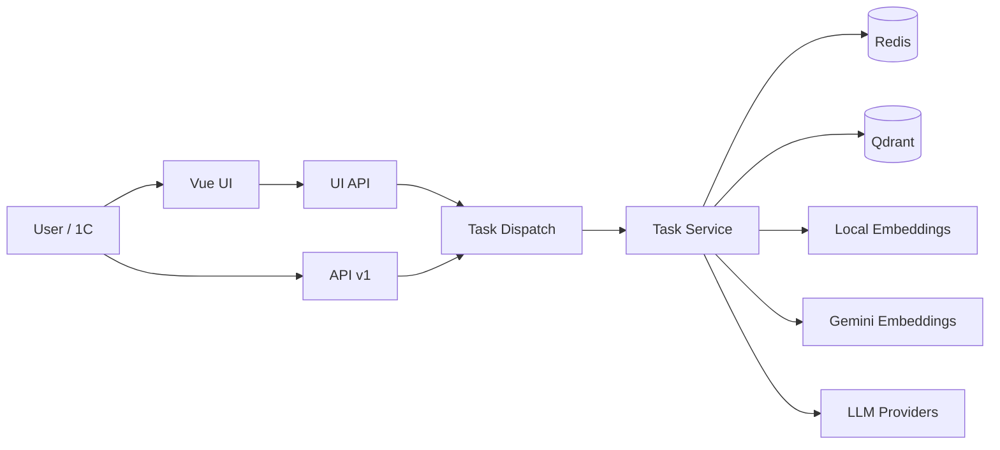

# Nomenclature Normalization Platform

Документ описывает проект в формате технической записки для защиты перед комиссией: назначение, архитектура, функциональность, запуск, эксплуатация, отказоустойчивость, тестирование и эволюцию по коммитам.

---

## 1. Аннотация и цель решения

Проект автоматизирует обработку товарной номенклатуры для 1С:

- кластеризует похожие позиции,
- нормализует и структурирует атрибуты,
- формирует обогащённые стандартизованные наименования,
- хранит векторную память в Qdrant,
- поддерживает ручную верификацию и корректировку человеком.

Практический эффект:

- ускорение подготовки справочников,
- снижение количества дублей и ручных ошибок,
- повторное использование накопленного знания через векторную память,
- устойчивость к внешним сбоям (частичные результаты, resume/restart).

---

## 2. Полный функционал системы

### 2.1 Обработка исходных данных

- загрузка CSV/XLSX;
- очистка пустых строк и точных дублей;
- выбор колонки-источника номенклатуры;
- включение/исключение атрибутов из обработки;
- добавление/редактирование/удаление строк и колонок.

### 2.2 Кластеризация

- фоновые задачи кластеризации;
- векторизация `local` или `gemini` (с fallback на local);
- объединение новых товаров и сопоставление с памятью Qdrant;
- генерация профиля кластера через LLM (категория, атрибуты, шаблон имени).

### 2.3 Нормализация

- извлечение значений атрибутов для позиций;
- стандартизация единиц и словарных значений;
- сборка обогащённых имён по шаблону;
- локальный дедуп внутри кластера;
- режимы:
    - обычный запуск,
    - `resume` (продолжить после сбоя),
    - `restart` (начать заново),
    - перенормализация кластера:
        - всех атрибутов,
        - только новых/пустых.

### 2.4 Работа с памятью Qdrant

- сохранение одного/всех кластеров;
- загрузка кластера из памяти;
- полная подгрузка кластера (включая поведение атрибутов и member-values);
- удаление кластера/элемента из памяти;
- семантический поиск по памяти (локальные эмбеддинги).

### 2.5 Ручные операции в UI

- редактирование кластера и шаблона;
- merge/split строк;
- перенос строк между кластерами;
- настройка merge-режима атрибутов (`priority` / `accumulative`);
- ручной редедуп после правок.

### 2.6 Экспорт

- XLSX всех кластеров,
- CSV (zip) всех кластеров,
- XLSX/CSV выбранного кластера.

### 2.7 Администрирование

- очистка Redis из UI/скриптом,
- очистка Qdrant из UI/скриптом,
- миграция векторной памяти на named vectors.

---

## 3. Архитектура решения

### 3.1 Компоненты



### 3.2 Принципы архитектуры

- FastAPI + сервисный слой + порт/адаптеры (`service/ports` + `infrastructure/*`);
- фоновые задачи через `BackgroundTasks`;
- состояние задач и кэш LLM в Redis;
- векторная память в Qdrant с named vectors (`local`, `gemini`);
- UI API (`/ui/api/*`) как BFF для веб-клиента;
- API v1 (`/api/v1/*`) для системной интеграции с 1С.

---

## 4. Backend: подсистемы и ответственность

### 4.1 Стек backend

- Python 3.10, FastAPI, Uvicorn;
- Pydantic v2;
- Redis (`redis.asyncio`);
- Qdrant (`qdrant-client`);
- sentence-transformers + torch + scikit-learn;
- Google Gemini (`google-genai`) и g4f;
- openpyxl, python-multipart;
- pytest.

### 4.2 Структура backend

```text
backend/
  main.py
  core/lifespan.py
  api/
    v1/tasks.py
    task_dispatch.py
    ui_router.py
  service/
    task_service.py
    ports/
  infrastructure/
    db/
    llm/
    ml/
    naming/
    utils/
  schemas/
  scripts/
  tests/
```

### 4.3 Жизненный цикл фоновых задач

Статусы:

- `PENDING`
- `PROCESSING`
- `COMPLETED`
- `FAILED`

Состояние задачи хранится в Redis (`task:{task_id}`), TTL 24 часа.

### 4.4 Отказоустойчивость

- fallback векторизации на local при недоступности Gemini;
- fallback поиска в памяти: Gemini vector -> local vector -> legacy;
- partial result во время normalize;
- сохранение partial result при ошибке;
- `resume/restart` без потери уже обработанных данных;
- retry и rate-limit стратегия для LLM/Gemini.

---

## 5. Frontend: UX и пользовательские потоки

### 5.1 Технологии frontend

- Vue 3 (`script setup`), Vite;
- `@lucide/vue` для иконок;
- composables для API/session/source-table;
- SPA без vue-router, вкладочная навигация.

### 5.2 Основные вкладки

- `Поиск`
- `Исходные данные`
- `Кластеры` (`cluster-0..N`)

### 5.3 Основной сценарий пользователя

1. загрузка файла и настройка источника;
2. запуск кластеризации;
3. ручная правка кластеров;
4. запуск нормализации;
5. при сбое: `Продолжить` или `Заново`;
6. сохранение в Qdrant;
7. экспорт.

### 5.4 Поллинг задач и статус

- UI опрашивает `/ui/api/task/{session_id}/{task_type}` примерно раз в 1.2 секунды;
- отображается прогресс и промежуточные результаты;
- после `FAILED` для normalize доступны recovery-кнопки;
- после `COMPLETED` данные синхронизируются из session API.

### 5.5 Поиск по памяти

- вкладка `Поиск` + строка запроса;
- поиск выполняется строго локальными эмбеддингами;
- таблица результатов:
    - действие (иконка открыть кластер),
    - обогащённое имя,
    - кластер;
- при открытии результата:
    - подгружается кластер,
    - находит строку,
    - прокручивает к ней,
    - временно подсвечивает.

---

## 6. Интеграции и данные

### 6.1 Redis

Используется для:

- состояния фоновых задач (`task:*`);
- кэша LLM-ответов (`gemini_cache:*`).

TTL:

- задачи: 24 часа;
- кэш: 30 дней.

### 6.2 Qdrant

Коллекция памяти хранит:

- `payload`: `text`, `attributes`, `cluster_name`, `original_items`, `original_item_values`, `attribute_merge`, `attribute_merge_separators`;
- `vectors`: named vectors:
    - `local` (обязателен),
    - `gemini` (опционален).

### 6.3 Провайдеры LLM и эмбеддингов

- LLM: `g4f` / `gemini`;
- Embeddings:
    - local (`cointegrated/rubert-tiny2`),
    - gemini (`gemini-embedding-001`).

---

## 7. API-справочник

### 7.1 API v1 (интеграция)

- `POST /api/v1/tasks/clusterize`
- `POST /api/v1/tasks/normalize`
- `GET /api/v1/tasks/{task_id}/status`
- `GET /api/v1/tasks/{task_id}/result`
- `POST /api/v1/memory/save`

### 7.2 UI API (BFF)

Ключевые группы:

- session management: `/ui/api/session/*`;
- source-table: `/ui/api/upload`, `/ui/api/rows/*`, `/ui/api/columns/*`, `/ui/api/configure`;
- tasks: `/ui/api/clusterize/start`, `/ui/api/normalize/start`, `/ui/api/task/{session_id}/{type}`;
- clusters: `/ui/api/clusters/*`;
- memory: `/ui/api/memory/*`, `/ui/api/clusters/{session_id}/memory/load`, `/memory/load-full`;
- export: `/ui/api/export/*`;
- admin: `/ui/api/admin/flush-redis`, `/ui/api/admin/flush-qdrant`.

---

## 8. Развертывание и запуск

### 8.1 Быстрый старт (Docker)

```bash
cp .env.example .env
docker compose up -d --build
```

После запуска:

- UI: `http://localhost:5173`
- API: `http://localhost:8000`
- Swagger: `http://localhost:8000/docs`
- Qdrant: `http://localhost:6333`
- Redis: `localhost:6379`

### 8.2 Локальный запуск без Docker

```bash
python -m venv .venv
.venv\Scripts\activate
pip install -r backend/requirements.txt
uvicorn backend.main:app --reload --host 0.0.0.0 --port 8000
```

Frontend:

```bash
cd frontend
npm ci
npm run dev
```

---

## 9. Конфигурация (`.env`)

### 9.1 Ключевые параметры

| Переменная                      | Назначение                |
| ------------------------------- | ------------------------- |
| `REDIS_URL`                     | подключение к Redis       |
| `QDRANT_URL`                    | подключение к Qdrant      |
| `GEMINI_API_KEY`                | ключ Gemini               |
| `GEMINI_MODEL`                  | LLM модель Gemini         |
| `GEMINI_EMBEDDING_MODEL`        | модель эмбеддингов Gemini |
| `G4F_MODEL`                     | модель g4f                |
| `CLUSTERIZE_DISTANCE_THRESHOLD` | порог кластеризации       |
| `ENRICHED_DEDUP_THRESHOLD`      | порог дедупа              |
| `LLM_BATCH_SIZE`                | batch для cluster profile |
| `LLM_NORMALIZE_BATCH_SIZE`      | batch для normalize       |
| `LLM_REQUEST_DELAY_SECONDS`     | пауза между LLM-запросами |
| `LLM_RATE_LIMIT_RETRY_SECONDS`  | базовая пауза при 429     |
| `LLM_MAX_RETRIES`               | число повторов            |

### 9.2 Дополнительные переменные из кода

- `QDRANT_PATH`
- `MEMORY_GEMINI_VECTOR_SIZE`
- `GEMINI_VECTOR_SIZE`
- `GEMINI_EMBEDDING_BATCH_SIZE`
- `GEMINI_EMBEDDING_REQUEST_DELAY_SECONDS`

---

## 10. Тестирование и качество

Запуск:

```bash
pytest -q backend/tests
```

Покрытие включает:

- `task_service`: clusterize/normalize, partial, resume;
- `vector_store`: похожесть, named vectors, fallback;
- `ui_router`: сборка/группировка кластеров;
- LLM интеграционные сценарии через моки;
- standardizer и parsing utilities.

Что это снижает:

- регрессии в pipeline;
- потерю partial результатов;
- ошибки merge/attribute поведения;
- поломки в памяти Qdrant.

---

## 11. Эксплуатация и администрирование

### 11.1 Полезные команды

Тесты:

```bash
pytest -q backend/tests
```

Очистка Redis:

```bash
python backend/scripts/flush_redis_cache.py --yes
```

Очистка Qdrant:

```bash
python backend/scripts/flush_qdrant_memory.py --yes
```

Миграция памяти в named vectors:

```bash
python backend/scripts/migrate_memory_named_vectors.py
```

### 11.2 Сброс в Docker

Полный сброс данных сервисов:

```bash
docker compose down -v
```

---

## 12. Troubleshooting

### 12.1 `503 UNAVAILABLE` во время normalize

- UI сохраняет partial result;
- доступно `Продолжить` (`resume`) или `Заново` (`restart`).

### 12.2 `429` / rate limit LLM

- увеличить `LLM_REQUEST_DELAY_SECONDS`;
- уменьшить `LLM_BATCH_SIZE` и `LLM_NORMALIZE_BATCH_SIZE`;
- проверить ключ и квоты Gemini.

### 12.3 API не выходит в healthy

- проверить логи `docker compose logs -f api`;
- первый старт дольше из-за загрузки моделей;
- убедиться в доступности Redis/Qdrant.

### 12.4 Данные в памяти “странные”

- выполнить полный цикл clusterize -> normalize -> save-memory;
- при необходимости очистить Qdrant и пересохранить;
- использовать `load-full` для полной подгрузки кластера памяти.

---

## 13. Эволюция проекта по коммитам

Ключевые этапы:

1. **MVP**: базовый FastAPI и in-memory задачи.
2. **Векторизация и ML**: локальные эмбеддинги + кластеризация.
3. **Инфраструктура состояния**: Redis для статусов и кэша.
4. **Память**: переход на Qdrant.
5. **Провайдеры LLM**: поддержка g4f + Gemini.
6. **UI и контейнеризация**: отдельный frontend, проксирование API.
7. **Надежность**:
    - dual vectors (`local` + `gemini`),
    - partial normalize,
    - resume/restart,
    - расширенные fallback-механики.

По истории видно движение от прототипа к промышленному решению с явным фокусом на устойчивость и управляемость.

---

## 14. Лицензионно-технические замечания

- Для Gemini обязателен валидный `GEMINI_API_KEY`.
- В dev-режиме CORS открыт для удобства интеграции.
- Admin flush endpoints предполагают доверенную среду эксплуатации.
